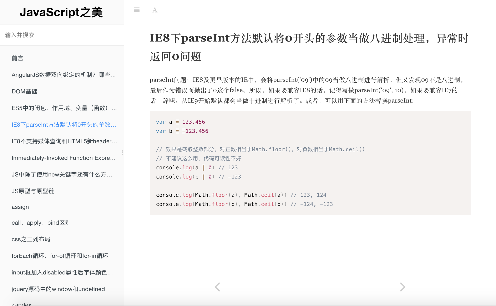

# GitBook Theme - for websites focusing on code

This is based on the default theme for GitBook since version `3.0.0`.



Example configuration (book.json):

```json
{
  "title": "Site Title",
  "author": "Author Name",
  "authorHomepage": "http://www.example.com",
  "description": "site description",
  "language": "zh-hans",
  "copyright": "All Rights Reserved",
  "plugins": [
    "theme-code",
    "splitter",
    "prism",
    "expandable-chapters",
    "-sharing"
  ],
  "pluginsConfig": {
    "theme-default": {
      "showLevel": false
    }
  }
}
```
